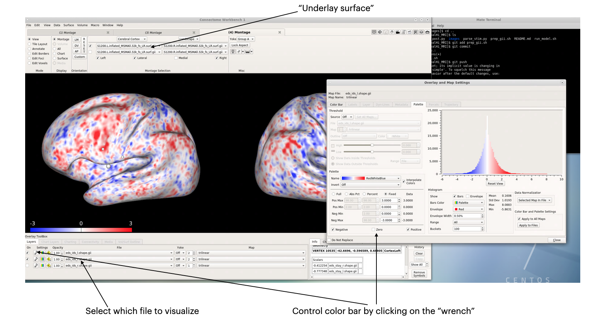

# testing out connectome workbench

## prepare input data
Need to convert afni output into 3dAFNItoNIFTI. This will be the input for visualization.

    3dAFNItoNIFTI -prefix /data/backed_up/shared/ThalHi_MRI_2020/3dMEMA/eds.nii.gz /data/backed_up/shared/ThalHi_MRI_2020/3dMEMA/EDS_MEMA_2021_03_29_15_19_17+tlrc.

Then need to project the nii file onto the surface, need to specify the end surface space. After some testing, the interpolation to the midthickness file seem to be work well. We would have to do it for L and R surface separately.

    wb_command -volume-to-surface-mapping /data/backed_up/shared/ThalHi_MRI_2020/3dMEMA/eds_stay.nii.gz /data/backed_up/shared/wb_files/HCP_S1200_GroupAvg_v1/S1200.L.midthickness_MSMAll.32k_fs_LR.surf.gii /data/backed_up/shared/ThalHi_MRI_2020/3dMEMA/eds_stay_l.shape.gii -trilinear

    wb_command -volume-to-surface-mapping /data/backed_up/shared/ThalHi_MRI_2020/3dMEMA/eds_stay.nii.gz /data/backed_up/shared/wb_files/HCP_S1200_GroupAvg_v1/S1200.R.midthickness_MSMAll.32k_fs_LR.surf.gii /data/backed_up/shared/ThalHi_MRI_2020/3dMEMA/eds_stay_l.shape.gii -trilinear

Open up wb_view on thalamege, you can load both the surface file and the new shape.gii files you created. The workbench menu will have demos on how to play around its GUI system. Suitable surfaces can be found under /data/backed_up/shared/wb_files/HCP_S1200_GroupAvg_v1

